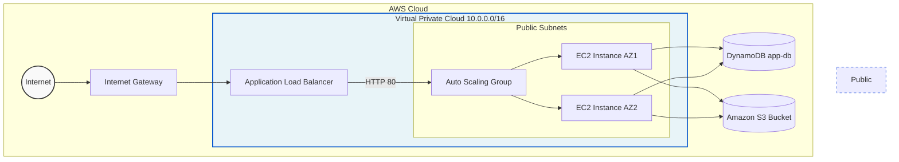

<div align="center">
  <h1>🚀 AWS Infrastructure Pipeline</h1>
  
  <p>
    <b>A highly available, secure, and scalable AWS infrastructure orchestrated with Terraform.</b>
  </p>
  
  [](https://www.terraform.io/)
  [](https://aws.amazon.com/)
  [](#)
</div>

---

## 📖 Overview

This repository contains a modular, production-ready Terraform configuration designed to provision a robust AWS infrastructure pipeline. By strictly decoupling resources into specialized modules, the architecture achieves maximum reusability, minimizes the blast radius, and adheres to the principle of least privilege.

## 🏗️ Architecture Design

The infrastructure is strategically broken down into four distinct Terraform modules:

- **`modules/network`**: Provisions a Virtual Private Cloud (VPC) with a `10.0.0.0/16` CIDR block, multiple public subnets across availability zones, an Internet Gateway, and highly available routing.
- **`modules/compute`**: Deploys an Application Load Balancer (ALB) and an Auto Scaling Group (ASG) using Launch Templates. Implements strict, layered Security Groups for zero-trust internal traffic.
- **`modules/database`**: Provisions a DynamoDB table (`app-db`) utilizing `PAY_PER_REQUEST` billing for flexible and cost-effective NoSQL storage.
- **`modules/storage`**: Creates a secure Amazon S3 bucket, enforcing strict ownership controls and blocking all public access to guarantee maximum data security.

### 📊 Architecture Flowchart



---

## 🔐 Security & Best Practices

- **Modularization**: Code is strictly separated by resource type, ensuring high reusability and isolated fault domains.
- **State Management**: Terraform state is configured to be securely backed by an S3 backend (`demo-app-deploy-335-vishnu-2026`) with DynamoDB state locking.
- **Parameterization**: Hardcoded sensitive credentials, availability zones, and instance types have been abstracted into variables for secure and flexible configuration.
- **Least Privilege**: Security groups strictly control traffic, ensuring compute instances are only accessible via the Application Load Balancer.

---

## 🚀 Getting Started

### 1. Prerequisites
- **Terraform** v1.0.0 or higher.
- **AWS CLI** configured with appropriate IAM credentials.

### 2. Deployment

```bash
# Clone the repository
git clone https://github.com/VishnuSaravanan335/Infrastructure_Pipeline.git
cd Infrastructure_Pipeline

# Initialize Terraform (downloads providers & configures backend)
terraform init

# Review the deployment plan
terraform plan

# Apply the configuration
terraform apply -auto-approve
```

---

## 🎉 Deployment Results

Once deployed, the infrastructure successfully provisions all resources and provides the necessary output variables. 

### Output Summary
- `alb_dns_name`: The DNS name of the Application Load Balancer to access the application.
- `dynamodb_table_name`: The name of the provisioned DynamoDB table.
- `s3_bucket_name`: The name of the provisioned S3 bucket.

### 📸 Execution Result

Below is a snapshot of the successful deployment verification from the terminal, showing the provisioned state, database creation, and output confirmation:

<details>
<summary><b>View Raw Terminal Verification Logs</b></summary>

```text
[ec2-user@ip-172-31-110-9 ~]$ terraform state list
aws_autoscaling_group.app_asg
aws_dynamodb_table.app_db
aws_instance.app_vm
aws_internet_gateway.igw
aws_launch_template.app_lt
aws_lb.app_lb
aws_lb_listener.app_listener
aws_lb_target_group.app_tg
aws_route_table.public_rt
aws_route_table_association.public_assoc_a
aws_route_table_association.public_assoc_b
aws_s3_bucket.app_bucket
aws_s3_bucket_ownership_controls.app_bucket_owner
aws_s3_bucket_public_access_block.app_bucket_block
aws_security_group.app_sg
aws_subnet.public_subnet_a
aws_subnet.public_subnet_b
aws_vpc.main_vpc

[ec2-user@ip-172-31-110-9 ~]$ curl http://$(terraform output -raw alb_dns_name)

[ec2-user@ip-172-31-110-9 ~]$ aws s3 ls s3://$(terraform output -raw s3_bucket_name)

[ec2-user@ip-172-31-110-9 ~]$ aws dynamodb list-tables --region us-east-1
{
    "TableNames": [
        "app-db",
        "terraform-locks"
    ]
}

[ec2-user@ip-172-31-110-9 ~]$ terraform output
alb_dns_name = "app-lb-1701439727.us-east-1.elb.amazonaws.com"
dynamodb_table_name = "app-db"
s3_bucket_name = "demo-app-storage-vishnu-2026"
```
</details>

---

<div align="center">
  <sub>Built with ❤️ utilizing Terraform & AWS</sub>
</div>
